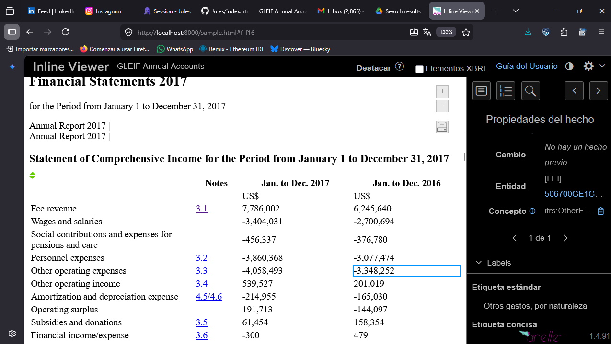

# Demo de Visor iXBRL (Arelle / Workiva Open Source)

Este repositorio contiene un entorno de prueba para visualizar archivos iXBRL (como los generados por Altova) con un panel interactivo, similar a la experiencia que ofrece Workiva.

## Arquitectura y Flujo de Trabajo

Para lograr el "efecto Workiva" a partir de un archivo crudo de Altova, se requieren tres pasos:

1. **Generación (Altova / Sistema Contable):** Se genera un archivo iXBRL crudo. Este archivo es un documento HTML estándar pero contiene las etiquetas financieras ocultas (Inline XBRL).
2. **Procesamiento (Arelle):** El visor no puede leer directamente el HTML en tiempo real; requiere "preparación". Arelle toma tu iXBRL crudo, valida la taxonomía, extrae la estructura contable y compila un paquete de datos JSON. Arelle luego incrusta este JSON y un enlace al código JavaScript del visor (`ixbrlviewer.js`) en el archivo.
3. **Visualización:** Al abrir el archivo procesado por Arelle en un navegador, el JavaScript del visor lee el JSON incrustado y dibuja el panel interactivo, permitiendo al usuario hacer clic en los números y ver los detalles contables.

### Opciones de Hosting (Ej. Digital Ocean)

Dependiendo de tus necesidades, tienes dos arquitecturas:

* **Opción A (Recomendada si hay pocos generadores):**
  Instalas Altova y Arelle localmente en tu PC. Generas el iXBRL, lo procesas en tu computadora con Arelle para obtener el HTML final, y luego **solo subes el HTML estático** a Digital Ocean (o cualquier servidor web simple).
* **Opción B (Recomendada para plataformas / múltiples usuarios):**
  Configuras tu servidor en Digital Ocean con Arelle instalado (por ejemplo, en un Docker). Desarrollas una pequeña web donde tu equipo suba los iXBRL crudos de Altova, el servidor ejecute Arelle automáticamente por detrás, y exponga el archivo final interactivo.

## Cómo probar este repositorio

En este repositorio hemos descargado un archivo de ejemplo (`sample.html`) que **ya ha sido procesado por Arelle**. Para verlo funcionando:

1. Ejecuta el servidor Python local para evitar problemas de CORS:
   ```bash
   python3 server.py
   ```
2. Abre tu navegador y dirígete a:
   [http://localhost:8000/index.html](http://localhost:8000/index.html)
   *(O directamente a http://localhost:8000/sample.html para ver el archivo de ejemplo).*

## Dependencias

El visor interactivo cargado en el archivo `index.html` (y en los archivos procesados por Arelle) es un proyecto de código abierto mantenido por Arelle (originalmente donado por Workiva). En este ejemplo, se está cargando a través del CDN: `https://cdn.jsdelivr.net/npm/ixbrl-viewer@1.4.91/iXBRLViewerPlugin/viewer/dist/ixbrlviewer.js`.
## Resultado
A continuación se muestra una captura de pantalla del visor iXBRL cargando correctamente el archivo procesado por Arelle:


